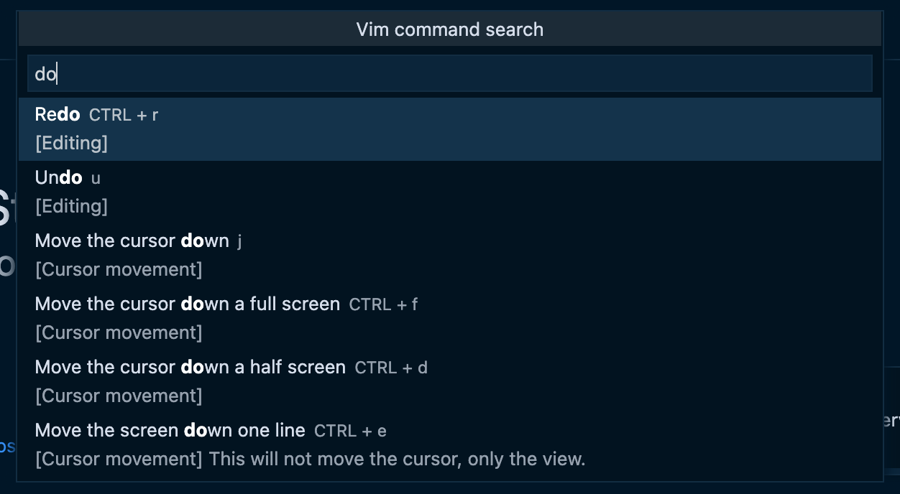

# vim.how for VSCode

Vim command search for VSCode. Similar to [vim.how](https://vim.how) on the web.

## Features

Adds "Vim command search" to the command palette where you can search for commands and see how to use them. It is meant as a quick reference when you know the basics of Vim.

Press enter on a command to keep a small info message window around with the keys required while you edit the code.

## Release Notes

### 1.0.0

Initial release.
